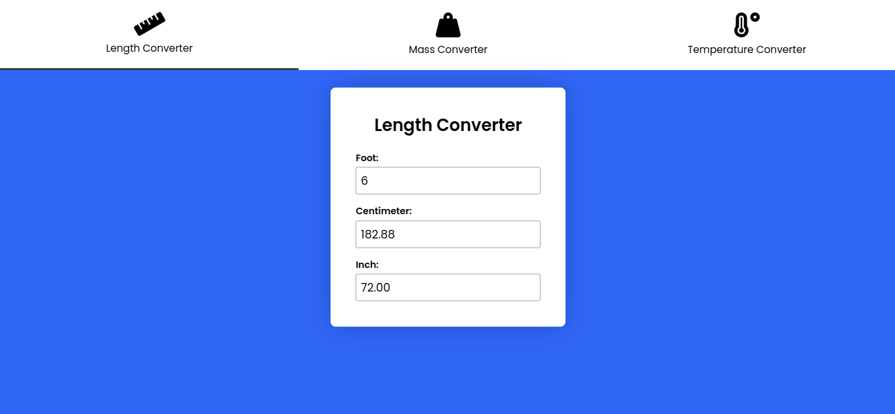
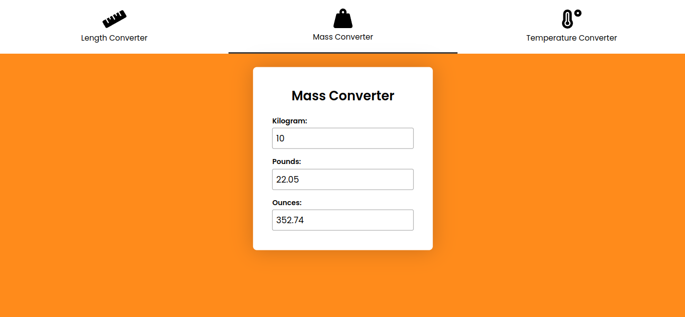

# EasyConvert

### Units of measurement converter

------------------------------------------------------------------------------------------------------------------------------------------------

A JavaScript-based web application that provides a simple and intuitive interface for converting units of measurement in different categories, such as length, weight, and temperature. In this project i tried to use my knowledge to use event listeners, Javascript DOM, Functions and Conditional. The big takeaway: 

* Uses event listeners to detect user input and dynamically updates the output fields with the converted values, based on pre-defined conversion functions
* Features a tab-based interface with color-coded tabs that are switch depending on the selected tab
* Code is organized into modular functions that can be easily adapted or extended to support additional conversion types or user interface features.
* The code includes functions to convert between different units of length, mass, and temperature

I used all of these concepts for the first time in this project, and was able to successfully implement them in the first four day sprint.

### To get started:
To use EasyConvert, you can clone the project from Github or download the files directly to your computer. The index.html file contains the HTML markup for the user interface, while the style.css file contains the CSS styles. The script.js file contains the JavaScript code that powers the conversion logic.

* open the `index.html` file in your web browser to use the Multi-Converter.

There are three tabs at the top of the page, one for each category: Length, Mass, and Temperature. Clicking on each tab will reveal a form where you can enter a value in one unit and see the equivalent values in the other units for that category.

* The Length category allows you to convert between feet, centimeters, and inches. You can enter a value in any of the three input fields, and the other two fields will update automatically as you type.

